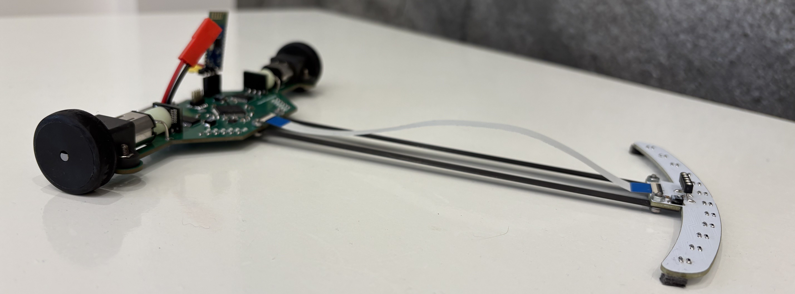
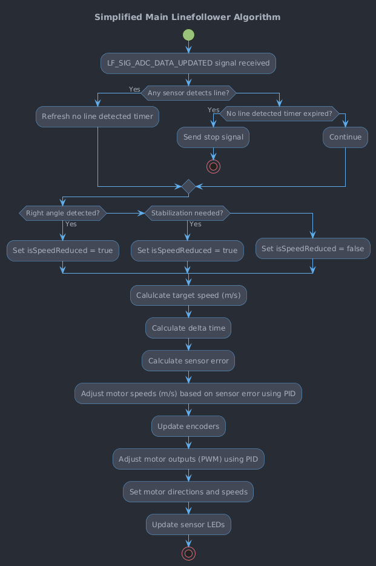
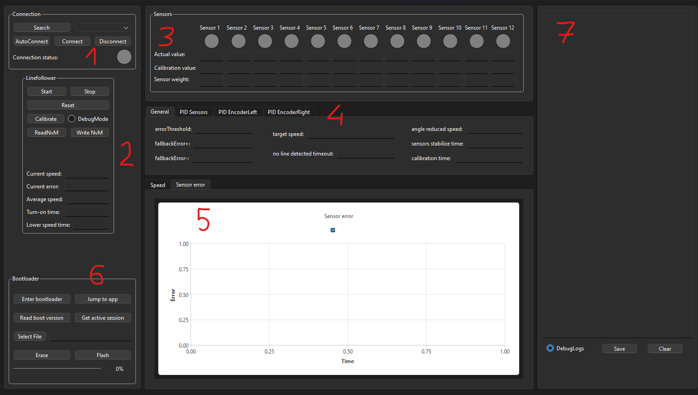

## Introduction

The LineFollower Robot is an autonomous robot designed to follow a predefined path marked by a black or white line. 
This project serves a quite advanced solution including hardware project, embedded software and PC QT application.

Example linefollower run (on of the first LineFollower Kwark runs):

  

## Hardware
### **High level block diagram**

[](https://mermaid.live/edit#pako:eNqVlW1vmzAQx7-K5ddJGiCEBE2T8tB2VWHJIM2kOVXlBjdBAxw59tb04bvPxk0ChLYaL8Bnfvf33dkcz3BJIwJduGJ4swaz4SJbZEBeW3Gvp0Y0TUUWLzGPaQZQybzVrLqGiSCcUr5GhxHwaSQS8gaRLDrRntK_hN2FYrNJdgDlFtBWQdmLp9S568yRGgCn1ZmDIeacsCIUcnwfJ_ETYdadNUdWy5qDOU04XhEQkJVIMKesRhQ0my9K8qXZ_FoReT9sf3QDkLwV9KKYkWVeIS84zk7CkWn7355QfgeT7TJOdCRq3ZF3rZed-ZZ54ZgmOow-qFlIsi2VRdttOUkB0mZtJGozD_XJsS0yzEdwPbsK2o5hhMV6nI_1SzW4PfFT4Q7Go3K4BWo_pbjL6dUkB5XUSR7nmTpwzEOD0G532nsbeOSB35aQoIoE8WpdYTy14A-BI4a5YKQuvr3ax2SlyGMW_yEA5Y9CNXwq9y6flAnMht2uYV58v9R0KYUKHJzCxWQOtIfyR61S8Pau6liq_fSnf3aofzHa_-SD-pyVi45iIvhG8KObV5_3-w7VFbQ2XmVEQ_sNrlahHgtOztmxC32RHjeDYFZ3OEoNSHKqb-gYRzefEKXv8H327NBd8pJ8IlrqrrABU8JSHEeyPz8rzwXka5KSBXTlMMLs9wIuslfJYcFpuMuW0OVMkAZkVKzW0H3AyVZaYhNhTsYxloc73SMbnP2itGhC9xk-QtexW72O_PC6_b7TdtqW0YA76Bq9luUYdsfoO92-2XOM1wZ8yv3brb7V6Rt2z7ZkV-nZpnQgUSw3y9e_lvwP8_oPiOn1SA)

### **Schematic**
Electronic circuit diagrams are available in the [Hardware/release/schematic](Hardware/release/schematic) folder. 
Gerbers files are available in the [Hardware/release/gerbers](Hardware/release/gerbers) folder.

### **Component Details**
1. **STM32F722 MCU**  
ARM Cortex M7 microcontroller operating at the 216MHz with FPU, Cache, ITCM, DTCM. It powerful enough to handle algorithms and real-time processing required in linefollower applications.
3. **12x KTIR0711S**  
Phototransistor-based infrared sensors used to detect the line by measuring reflected IR light. Arranged in a array at the front of the robot to detect the position of the line. Outputs are connected to the MCU's ADC channels for monitoring.
4. **12x LEDs**  
Each LED corresponds to a KTIR0711S sensor, turned on when the sensor detects the line.
5. **2x AMS AS5040 Encoders**  
10-bit contactless magnetic rotary encoders providing precise angular position measurements. Thanks to the closed-loop control, encoders enables precise control of motor by providing feedback (velocity) for PID controllers.
6. **2x Pololu TB6612FNG Motor Driver Modules**  
H-bridge motor driver modules capable of controlling DC motors. Controller channels are combined to obtain higher current capacity.
7. **2x Pololu Motor 10:1 HPCB 6V DC Motors**  
High-power micro metal gearmotors with a 10:1 gear ratio
8. **Bluetooth Module JDY-31**  
Bluetooth serial module enables wireless communication between the robot and PC application.
9. **Power Supply Components**  
LiPo 7.4V battery used due to high energy density and ability to deliver powerful burst of current. 
3.3V Low dropout voltage regulator - steps down the battery voltage for MCU, sensors and others modules.

## Software

### **Main run loop**

The core functionality is implemented through an event-driven state machine. The primary signal is the LF_SIG_ADC_DATA_UPDATED, which is raised whenever new ADC data is available. Currently every 5ms, however increasing this frequency can lead to better control results.

The activity diagram presents simplified main robot algorithm in RUN state:

  

### **Code Structure**

Short brief about implemented software components:

- **linefollower:**
The core component of the software, manages the main event driven state machine. It handles the initialization of all subsystems. This component integrates sensor data processing, PID control algorithms, encoder feedback, and motor management. Additionally, it facilitates communication with the PC application for debugging and configuration purposes.
- **linefollower_config:**
Defines the default configurations and settings for the robot. This ensures that all hardware related configurations is easily adjustable.
- **lf_signal_queue:**
Implements a signal queue used for managing events and signals within the state machine.
- **linefollower_commands:**
Handles the processing of serial communication protocol (SCP) commands received from the PC application. It defines a set of commands for controlling the robot's modes, resetting the MCU, initiating calibration, reading and writing NVM data, toggling debug mode, retrieving session information, and entering the bootloader for firmware updates.
- **lf_calibrate:**
Manages the calibration process for the sensors. It handles the collection of sensor data during calibration runs, computes appropriate threshold values based on the collected values.
- **sensors:**
The module is responsible for interfacing with the robot's sensors to detect the line. It processes ADC data to determine states and manages the associated LEDs. Also implements algorithms to detect specific straight lines and right angles.
- **pid:**
Implements the PID control algorithms used to regulate the robot's motor speeds based on sensor and encoder feedback.
- **encoder:**
Manages the interfacing with the motor encoders to track the robot's velocity.
- **tb6612_motor:**
The module interfaces with the TB6612 motor driver hardware to control the robot's motors.
- **nvm:**
The module handles non-volatile memory operations, enabling the storage and retrieval of configuration data, calibration settings, and runtime parameters. The module ensures data integrity through CRC verification. The nvm module allows the robot to retain configurations across power cycles.
- **scp:**
Implements the Serial Communication Protocol (SCP) used for communication between the robot and external interfaces such as the PC application.
- **scp_dispatcher:**
The module acts as a handler for processing SCP commands received via the scp module. It manages a global command queue using a circular buffer to store incoming data, parses SCP packets, verifies data integrity using CRC, and dispatches valid commands to their respective handlers.

## Bootloader
Implemented bootloader allows for over the air firmware updates without the need of programmer. This is particularly useful for making quick updates "on the road." The bootloader uses the implemented SCP (Serial Communication Protocol) to receive firmware updates over Bluetooth.

There are 2 methods to enter the Bootloader:
1. **Command-Based Entry From Application**  
Send a specific command to trigger reset to the bootloader.
2. **Backdoor Entry**  
Enter the bootloader upon power-up by sending a specific command. Ensures that firmware updates are always possible, even if the application has errors causing continuous resets.

## **QT Application**

The QT Application provides a graphical interface to control, configure, and monitor the robot. The main sections of the interface and their functionalities are as follows:
1. **Connection Panel**  
Connection indicator and buttons to establish or terminate Bluetooth communication.
2. **Control Panel** 
Starting, stopping, resetting, and calibrating the robot, along with options to enable debug mode, read/write NVM, and display real-time data (speed, error, and timing metrics).
3. **Sensors Panel** 
Real-time sensor data display showing actual values, calibration references, and sensor weights.
4. **Configuration** 
Includes settings for general parameters, PID tuning for motor control, and encoder adjustments.
5. **Graph** 
A real-time graph displaying motor speeds, speed reduction, sensors error, enabling data analysis and adjustments for optimal performance.
6. **Bootloader** 
Firmware update controls, including options to enter bootloader mode, switch to the main application and flash new firmware via Bluetooth.
7. **Logs** 
Real-time log display with options to save or clear logs, providing detailed event tracking for debugging.

